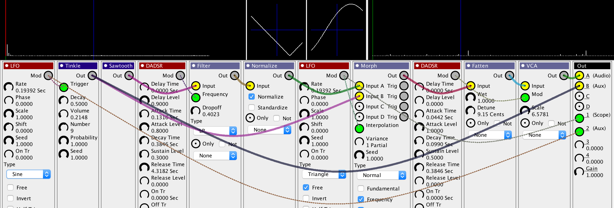

# Flow  
A Polyphonic, Multitimbral, Modular Additive Synthesizer (Version 9)
 
By Sean Luke (sean@cs.gmu.edu) \
With Help from Bryan Hoyle \
Copyright 2018 by George Mason University

Related projects:  

* [Edisyn](https://github.com/eclab/edisyn), a patch editor toolkit with sophisticated exploration tools.
* [Gizmo](https://cs.gmu.edu/~sean/projects/gizmo/), an Arduino-based MIDI Swiss Army knife.
* [*Computational Music Synthesis*](https://cs.gmu.edu/~sean/book/synthesis/), an open-content book on building software synthesizers.

## Donations

Donations are welcome via Paypal.

## About

Flow is a fully-modular multitimbral and polyphonic additive software synthesizer written in pure Java.  It runs on MacOS, Linux, and Windows.  I have used it to play individual patches and to play many simultaneous patches for a full song controlled over MIDI via a DAW.

Flow has almost 70 modules of different shapes and sizes, and currently supports up to 32 voices at up to 256 partials and 44.1KHz with a rate of one new partial update every 32 samples.  Flow is a very computationally expensive program and will keep your laptop quite warm and your fan busy.  You need to have some fairly good hardware to run Flow at full blast successfully (for reference, Flow was developed on a 2.8Ghz i7 2015 Macbook Pro Retina).  There are options for reducing Flow's footprint (such as reducing the number of voices or partials).

## Resources

* Flow has an [extensive manual](https://cs.gmu.edu/~eclab/projects/flow/flow.pdf) which discusses additive synthesis, Flow's modular approach, how to run it, how to integrate it with controllers and DAWs, and how to build new modules.

* One of Flow's modules is a wavetable synth.  It's designed to load wavetables built with [WaveEdit](http://synthtech.com/waveedit/), and there are quite a number to choose from on their associated website, [WaveEditOnline](https://waveeditonline.com/)

* Another of Flow's modules lets you load, draw, and save out partials.  This module can load single-cycle waves such as [Adventure Kid's Single Cycle Waveforms](https://www.adventurekid.se/akrt/waveforms/).

* Interested in helping out on Flow?  Our [To Do list](TODO.md) lists current open issues and bugs.

### Demos
* A [video demonstrating how to set up a simple patch in Flow](https://youtu.be/zkmEVWfly-0).

* Three songs made using only Flow in multitimbral mode, with Ableton serving as just the sequencer.  They are called [8](https://cs.gmu.edu/~sean/projects/synth/log/#8), [9](https://cs.gmu.edu/~sean/projects/synth/log/#9), and [10](https://cs.gmu.edu/~sean/projects/synth/log/#10).  8 is the best one. All three come with the Flow patches and Ableton files to recreate them.

[//]: <> ( Former hello-world demo: https://www.youtube.com/watch?v=w3aao8Sp0sQ )

### Patches

* Flow's demo patches are located [here](flow/patches).   Contribute some!   You can get a zip file of all of them [here](https://cs.gmu.edu/~eclab/projects/flow/patches.zip).

## Install and Run Flow

Flow is cross-platform and will run on a variety of platforms (Windows, Linux) but we are personally developing on and for MacOS and Linux. We'd appreciate feedback and screenshots of it running on Windows so we can tweak things.

### Installation and Running on MacOS

First install Flow from this link: [Flow.app.zip](https://cs.gmu.edu/~eclab/projects/flow/Flow.app.zip). 
Sadly, it's a whopping 70MB because it includes the Java VM.  :-(

You'll also want to download some [patches](https://cs.gmu.edu/~eclab/projects/flow/patches.zip), some [wavetables](https://waveeditonline.com/), and the [manual](https://cs.gmu.edu/~eclab/projects/flow/flow.pdf).  Pay attention to section 2.1 of the manual, where it explains how to tune Flow for your computer speed.  

Sierra has really locked down the ability to run an application that's not from a commercial, paying Apple Developer.  And GMU is not one.  So you will have to instruct Sierra to permit Flow to run.

Let's assume you stuck Flow in the /Applications directory as usual.  Then:

1. Run the Terminal Program (in /Applications/Utilities/)
2. Type the following command and hit RETURN: `   sudo spctl --add /Applications/Flow.app`
4. Enter your password and hit RETURN.
5. Quit the Terminal Program

Now you should be able to run Flow.  Let us know if this all works.

#### Notes on Catalina...

* Flow cannot access your laptop's microphone on Catalina.  I don't know if it can access external microphones.

### Installation and Running on Windows

The following should work (but has not been tested):

1. [Download and install at least Java 11](https://www.oracle.com/technetwork/java/javase/downloads).  The JRE should work fine.  Earlier versions of Java have a bug which causes Java apps (like Flow) to make teeny tiny windows on the latest high-resolution screens.

2. Download Flow's jar file, called [flow.jar](https://cs.gmu.edu/~eclab/projects/flow/flow.jar).

3. You'll also want to download some [patches](https://cs.gmu.edu/~eclab/projects/flow/patches.zip), some [wavetables](https://waveeditonline.com/), and the [manual](https://cs.gmu.edu/~eclab/projects/flow/flow.pdf).  Pay attention to section 2.1 of the manual, where it explains how to tune Flow for your computer speed.

4. Double-click on flow.jar to launch Flow.

#### Note

Flow makes heavy use of Java preferences.  There is a longstanding Java/Windows bug which breaks Java preferences and will cause Flow to be unable to make any of your preferences persistent.  In Java 11 the bug should be fixed, but if it's not, please let us know.

### Installation and Running on Linux

Flow should work fine if you have installed at least *Java 8*.

1. Install at least Java 8 (openjdk).

2. Download Flow's jar file, called [flow.jar](https://cs.gmu.edu/~eclab/projects/flow/flow.jar).

3. You'll also want to download some [patches](https://cs.gmu.edu/~eclab/projects/flow/patches.zip), some [wavetables](https://waveeditonline.com/), and the [manual](https://cs.gmu.edu/~eclab/projects/flow/flow.pdf).  Pay attention to section 2.1 of the manual, where it explains how to tune Flow for your computer speed.

4. You'll need to figure out how to make it so that double-clicking on the jar file launches it in java.  In Ubuntu, here's what you do: right-click on the jar file icon and choose "Properties".  Then select the "Open With" tab, and select your Java VM (for example "Open JDK Java 8 Runtime").  The press "Set as Default".  This makes the Java VM the default application to launch jar files.

5. Thereafter you should be able to just double-click on the file to launch Flow.

### Running from the command line (MacOS, Windows, Linux)

1. Make sure Java is installed as discussed earlier.

2. Download Flow's jar file, called [flow.jar](https://cs.gmu.edu/~eclab/projects/flow/flow.jar).

3. Grab some [patches](https://cs.gmu.edu/~eclab/projects/flow/patches.zip), some [wavetables](https://waveeditonline.com/), and the [manual](https://cs.gmu.edu/~eclab/projects/flow/flow.pdf).  

4. Run Flow as:   `java -jar flow.jar`

